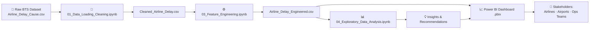

# Airline-Flight-Delay-Root-Cause-Analysis
I'm excited to share my latest Data Analytics project: Airline Flight Delay Root Cause Analysis Dashboard, developed using Python and Microsoft Power BI.
<div align="center">

# ✈️ Flight Delay Root Cause Analysis
### & Operational Performance Dashboard

**End-to-end data analytics project uncovering *why* U.S. commercial flights are delayed — from raw government data to an interactive Power BI decision-support tool.**

[](https://www.python.org/)
[](https://pandas.pydata.org/)
[](https://jupyter.org/)
[](https://powerbi.microsoft.com/)
[](#)
[](#-license)

</div>

---

## 📖 Table of Contents

- [Overview](#-overview)
- [Business Problem](#-business-problem)
- [Key Results at a Glance](#-key-results-at-a-glance)
- [Project Architecture](#-project-architecture)
- [Repository Structure](#-repository-structure)
- [Dataset](#-dataset)
- [Glossary of Delay Causes](#-glossary-of-delay-causes)
- [Methodology](#-methodology)
  - [1. Data Loading & Cleaning](#1-data-loading--cleaning)
  - [2. Feature Engineering](#2-feature-engineering)
  - [3. Exploratory Data Analysis](#3-exploratory-data-analysis)
- [Power BI Dashboard](#-power-bi-dashboard)
- [Key Findings](#-key-findings)
- [Business Recommendations](#-business-recommendations)
- [Tech Stack](#-tech-stack)
- [Getting Started](#-getting-started)
- [Limitations](#-limitations)
- [Future Scope](#-future-scope)
- [Author](#-author)
- [License](#-license)

---

## 🔎 Overview

Every year, tens of millions of U.S. flights are delayed, cancelled, or diverted — costing airlines, airports, and passengers billions of dollars and countless hours. Raw government delay data exists, but it's published in a disaggregated, code-heavy format that operations teams can't act on directly.

This project builds a **complete analytics pipeline** — from a raw 23-year government dataset to a polished, interactive Power BI dashboard — that answers one core question:

> **"Who is responsible for flight delays, why are they happening, and how is the situation trending?"**

The project is split into two connected parts:

| Part | What it does |
|---|---|
| 🐍 **Python / Jupyter (Notebooks 01, 03, 04)** | Cleans the raw data, engineers business KPIs, and performs structured exploratory analysis |
| 📊 **Power BI Dashboard (`.pbix`)** | Turns every analytical finding into an interactive, filterable, five-page report for non-technical stakeholders |

---

## 🎯 Business Problem

Flight delays create a ripple effect across the entire aviation system — missed connections, misaligned crews and aircraft, gate congestion, compensation costs, and eroded passenger trust. Without a consolidated root-cause view, airlines and airports risk **fixing the wrong problem** — e.g. tightening crew schedules when the real driver is a late inbound aircraft, or blaming weather when carrier-side inefficiency is the bigger contributor.

This project answers the specific business questions decision-makers actually need answered:

- 🏆 Which **airlines** and **airports** are the best / worst performers?
- 🧩 What is **actually causing** the delay — carrier, weather, air-traffic congestion, security, or a late aircraft?
- 📅 **When** do delays spike — by month, quarter, or season?
- 📈 Is there a relationship between **flight volume**, **cancellations**, and **delay rate**?
- 🖥️ How can all of this be delivered to **non-technical stakeholders** without them writing a single line of code?

---

## 📌 Key Results at a Glance

| Metric | Value |
|---|---|
| Study Period | 2003 – 2025 (23 years) |
| Airlines Analyzed | 51 |
| Airports Analyzed | 447 |
| Total Flights | 143,786,417 |
| Delayed Flights | 27,648,474 |
| Cancelled Flights | 2,697,082 |
| **Average Delay Rate** | **19.80%** |
| **Average On-Time Performance** | **80.20%** |
| Average Delay per Delayed Flight | 55.70 minutes |
| Total Delay Minutes | ≈ 2 billion minutes |
| Busiest Airline | Southwest Airlines Co. (16.8M flights) |
| Busiest Airport | Hartsfield-Jackson Atlanta Intl. (8.19M flights) |
| Best On-Time Airline | Aloha Airlines Inc. (≈92.9%) |
| **#1 Root Cause of Delay** | **Late Aircraft (≈38.4% of delay minutes)** |

---

## 🏗️ Project Architecture



---

## 📁 Repository Structure

```
flight-delay-root-cause-analysis/
│
├── notebooks/
│   ├── 01_Data_Loading_Cleaning.ipynb        # Data import, quality checks, cleaning
│   ├── 03_Feature_Engineering.ipynb          # KPI & categorical feature creation
│   └── 04_Exploratory_Data_Analysis.ipynb    # 8-section structured EDA
│
├── dashboard/
│   └── Airliness_delay_dashboard.pbix        # 5-page interactive Power BI report
│
├── assets/                                   # Dashboard screenshots (used below)
│   ├── executive-overview.png
│   ├── airline-performance.png
│   ├── airport-performance.png
│   ├── root-cause-analysis.png
│   └── time-analysis-trends.png
│
├── data/                                     # (not included — see Dataset section)
│   ├── Airline_Delay_Cause.csv
│   ├── Cleaned_Airline_Delay.csv
│   └── Airline_Delay_Engineered.csv
│
└── README.md
```

---

## 🗂️ Dataset

| | |
|---|---|
| **Source** | [U.S. Bureau of Transportation Statistics (BTS)](https://www.transtats.bts.gov/) — Airline Delay Cause dataset |
| **Granularity** | One row per **Airline × Airport × Month × Year** |
| **Time Span** | January 2003 – 2025 (23 years) |
| **Coverage** | 51 airlines · 447 airports |
| **Format** | CSV |

**Key columns (post-cleaning):**

| Category | Columns |
|---|---|
| Identifiers | `Airline_Code`, `Airline`, `Airport_Code`, `Airport`, `year`, `month` |
| Volume Counts | `Total_Flights`, `Delayed_Flights`, `Cancelled_Flights`, `Diverted_Flights` |
| Delay-Cause Counts | `Carrier_Delay_Count`, `Weather_Delay_Count`, `NAS_Delay_Count`, `Security_Delay_Count`, `Late_Aircraft_Delay_Count` |
| Delay-Cause Minutes | `Total_Delay_Minutes`, `Carrier_Delay_Minutes`, `Weather_Delay_Minutes`, `NAS_Delay_Minutes`, `Security_Delay_Minutes`, `Late_Aircraft_Delay_Minutes` |

> ⚠️ The raw dataset is not bundled in this repository due to size. Download it directly from the [BTS website](https://www.transtats.bts.gov/) and place it in a local `data/` folder before running the notebooks.

---

## 📚 Glossary of Delay Causes

Every delay in the dataset is attributed to **exactly one** of five standardized BTS categories:

| Cause | Definition |
|---|---|
| 🛫 **Carrier Delay** | Caused directly by the airline — e.g. maintenance/crew problems, cleaning, baggage loading, fuelling |
| 🌩️ **Weather Delay** | Caused by significant meteorological conditions — e.g. storms, fog, high winds |
| ✈️ **NAS Delay** | National Aviation System — air-traffic control congestion, non-extreme weather, airport ops, heavy volume |
| 🔒 **Security Delay** | Security-related events — terminal evacuation, re-boarding, long security lines |
| 🔁 **Late Aircraft Delay** | "Knock-on" effect — the incoming aircraft itself arrived late, delaying this flight's departure |

The engineered **`Dominant_Delay_Cause`** feature identifies which of these five categories drives the largest share of delay minutes for every record — this powers the root-cause drill-downs throughout the dashboard.

---

## 🔬 Methodology

### 1. Data Loading & Cleaning
`notebooks/01_Data_Loading_Cleaning.ipynb`

- ✅ Profiled the raw dataset (row/column counts, dtypes, missing values, duplicates, unique values)
- ✅ Removed rows with missing values
- ✅ Checked for and confirmed zero duplicate records
- ✅ Renamed cryptic BTS column codes → descriptive business names (`carrier` → `Airline_Code`, `arr_flights` → `Total_Flights`, etc.)
- ✅ Cast count columns to integer type
- ✅ Removed rows with physically-impossible **negative delay minutes** (found in `NAS_Delay_Minutes`)
- ✅ Exported → `Cleaned_Airline_Delay.csv`

**Result:** zero missing values · zero duplicates · zero negative values · fully typed and renamed.

### 2. Feature Engineering
`notebooks/03_Feature_Engineering.ipynb`

**Derived numeric KPIs:**

| Feature | Formula |
|---|---|
| `Delay_Rate` | `(Delayed_Flights ÷ Total_Flights) × 100` |
| `Cancellation_Rate` | `(Cancelled_Flights ÷ Total_Flights) × 100` |
| `Diversion_Rate` | `(Diverted_Flights ÷ Total_Flights) × 100` |
| `On_Time_Percentage` | `(On_Time_Flights ÷ Total_Flights) × 100` |
| `Avg_Delay_Per_Flight` | `Total_Delay_Minutes ÷ Delayed_Flights` |
| `*_Delay_%` (×5 causes) | `Cause Minutes ÷ Total_Delay_Minutes × 100` |

**Derived categorical features:**

- 🗓️ `Quarter` — month mapped to Q1–Q4
- ❄️☀️ `Season` — month mapped to Winter / Spring / Summer / Autumn
- 🚦 `Delay_Severity` — Low / Moderate / High / Critical, threshold-based on `Delay_Rate`
- 🎯 `Dominant_Delay_Cause` — the delay category responsible for the largest share of minutes per record (via row-wise `idxmax`)

**Result:** → `Airline_Delay_Engineered.csv`, the single source of truth for both the EDA notebook and the Power BI dashboard.

### 3. Exploratory Data Analysis
`notebooks/04_Exploratory_Data_Analysis.ipynb`

Structured into **8 sections**, each answering a specific business question:

| # | Section | Question Answered |
|---|---|---|
| A | Executive Overview | What are the headline numbers for the whole dataset? |
| B | Airline Performance | Which airlines perform best / worst? |
| C | Airport Performance | Which airports perform best / worst? |
| D | Delay Root Cause Analysis | What's actually causing the delays? |
| E | Time-Based Trend Analysis | When do delays spike — by year, month, season? |
| F | Relationship & Efficiency Analysis | How do volume, cancellations, and delay rate interact? |
| G | Executive Summary & Recommendations | So what should be done about it? |
| — | Key Analytical Findings | Consolidated top-line results table |

---

## 📊 Power BI Dashboard

**File:** `dashboard/Airliness_delay_dashboard.pbix`

An interactive, **5-page** report. Every page shares the same cross-filtering slicers: **Year · Quarter · Season · Airline · Airport · Dominant Delay Cause**.

<details open>
<summary><b>1️⃣ Executive Overview</b></summary>
<br>

KPI cards, monthly delay-rate trend, primary delay-cause donut, top-10 airlines/airports by delay rate, seasonal comparison, and a full delay-rate distribution histogram.


</details>

<details>
<summary><b>2️⃣ Airline Performance</b></summary>
<br>

Top airlines by volume, delay-cause composition, delay-rate ranking, on-time performance, cancellations, and a bubble-chart performance matrix (delay rate vs. on-time %, sized by volume).


</details>

<details>
<summary><b>3️⃣ Airport Performance</b></summary>
<br>

Top airports by volume (bar + treemap), cancelled flights by airport, seasonal delay-rate ribbon chart, delay-cause composition, and top airports by average delay per flight.


</details>

<details>
<summary><b>4️⃣ Root Cause Analysis</b></summary>
<br>

Overall delay-cause distribution, an Airport → Airline → Season → Quarter drill-down hierarchy, total delay minutes by airline, a waterfall of cause contribution, and seasonal dominant-cause breakdown.


</details>

<details>
<summary><b>5️⃣ Time Analysis & Trends</b></summary>
<br>

Yearly delay trend (2003–2025), quarterly on-time performance, volume-vs-delay-rate scatter, monthly trend, seasonal comparison, and a month-by-year delay-rate heatmap.


</details>

---

## 💡 Key Findings

| Finding | Result |
|---|---|
| Busiest Airline | Southwest Airlines Co. — 16.8M flights |
| Highest Delay-Rate Airline | Peninsula Airways Inc. — ≈31.5% |
| Best On-Time Airline | Aloha Airlines Inc. — ≈92.9% |
| Busiest Airport | Hartsfield-Jackson Atlanta Intl. — 8.19M flights |
| Dominant Delay Cause (overall) | **Late Aircraft** — ≈38.4% of delay minutes |
| Seasonality | Delay rate peaks in **summer**, dips in **autumn** |
| Anomalous Year | **2020** — sharp drop in both volume and delay rate |

---

## ✅ Business Recommendations

| Recommendation | Expected Impact | Why |
|---|---|---|
| Improve aircraft turnaround efficiency | ↓ Late aircraft delays | Late Aircraft = #1 cause (~38% of minutes) |
| Optimize crew scheduling | ↓ Carrier delays | Carrier delay is #2 and fully within airline control |
| Increase preventive maintenance | ↓ Maintenance-related delays | Reduces unplanned carrier-side disruption |
| Improve airport ground operations | ↓ Taxi-out time | Ground congestion compounds delay minutes |
| Strengthen weather forecasting integration | ↓ Weather disruption | Weather delays are seasonal and partly predictable |
| Enhance ATC / NAS coordination | ↓ NAS delays | NAS is the #3 contributor system-wide |
| Reduce gate congestion at top airports | ↑ Airport efficiency | High-volume hubs show delay-rate sensitivity |
| Improve passenger communication | ↑ Customer satisfaction | Reduces perceived harm even when delays persist |

---

## 🛠️ Tech Stack

| Category | Tool |
|---|---|
| Language |  |
| Data Manipulation |   |
| Visualization (EDA) |  |
| Environment |  |
| BI / Dashboard |  |
| Data Source | U.S. Bureau of Transportation Statistics (BTS) |

---

## 🚀 Getting Started

### Prerequisites
- Python 3.9+
- [Jupyter Notebook](https://jupyter.org/) or JupyterLab
- [Power BI Desktop](https://powerbi.microsoft.com/desktop/) (free) to open the `.pbix` file

### Installation

```bash
# 1. Clone the repository
git clone https://github.com/<your-username>/flight-delay-root-cause-analysis.git
cd flight-delay-root-cause-analysis

# 2. Create a virtual environment (optional but recommended)
python -m venv venv
source venv/bin/activate      # Windows: venv\Scripts\activate

# 3. Install dependencies
pip install pandas numpy matplotlib jupyter

# 4. Download the raw dataset from the BTS website and place it at:
#    data/Airline_Delay_Cause.csv

# 5. Run the notebooks in order
jupyter notebook notebooks/01_Data_Loading_Cleaning.ipynb
jupyter notebook notebooks/03_Feature_Engineering.ipynb
jupyter notebook notebooks/04_Exploratory_Data_Analysis.ipynb
```

### Viewing the Dashboard
Open `dashboard/Airliness_delay_dashboard.pbix` in **Power BI Desktop** and use the filter panel on each page to explore Year, Quarter, Season, Airline, Airport, and Dominant Delay Cause.

---

## ⚠️ Limitations

- Data is aggregated at the **airline–airport–month** level — no individual flight or passenger-level records.
- Only **arrival** delay data is included; no departure-delay or taxi-time breakdown.
- No aircraft type, age, or tail-number data — limits maintenance-specific root-cause analysis.
- No origin–destination **route-level** data.
- `Dominant_Delay_Cause` reflects the majority driver for an aggregated group, not necessarily every individual flight within it.
- 2020 reflects an extraordinary external disruption to global air travel — treat year-over-year comparisons that include it with care.

---

## 🔭 Future Scope

- [ ] Machine learning model to **predict** flight delays before they occur
- [ ] Live weather API integration for real-time analysis
- [ ] Drill-through pages and scheduled real-time refresh in Power BI
- [ ] Airline performance scorecard for continuous benchmarking
- [ ] Route-level and airport-level optimization studies
- [ ] Full flight-delay forecasting system
- [ ] Clustering airports by operational performance profile

---

## 👤 Author

**Bhati Devamjitsinh K.**

📧 [bhatidevamjit1776@gmail.com](mailto:bhatidevamjit1776@gmail.com)

---

## 📄 License

This project is licensed under the **MIT License** — feel free to use, modify, and distribute with attribution.

```
MIT License

Copyright (c) 2026 Bhati Devamjitsinh K.

Permission is hereby granted, free of charge, to any person obtaining a copy
of this software and associated documentation files, to deal in the Software
without restriction, including without limitation the rights to use, copy,
modify, merge, publish, distribute, sublicense, and/or sell copies of the
Software, subject to the following conditions:

The above copyright notice and this permission notice shall be included in
all copies or substantial portions of the Software.

THE SOFTWARE IS PROVIDED "AS IS", WITHOUT WARRANTY OF ANY KIND, EXPRESS OR
IMPLIED, INCLUDING BUT NOT LIMITED TO THE WARRANTIES OF MERCHANTABILITY,
FITNESS FOR A PARTICULAR PURPOSE AND NONINFRINGEMENT.
```

---

<div align="center">

⭐ If you found this project useful, consider giving it a star!

</div>
